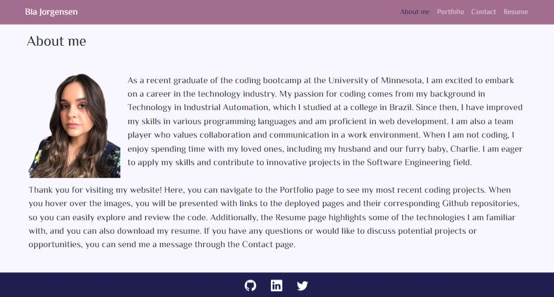
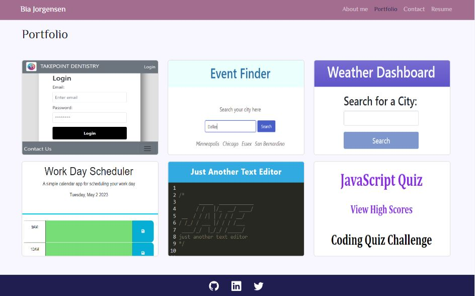
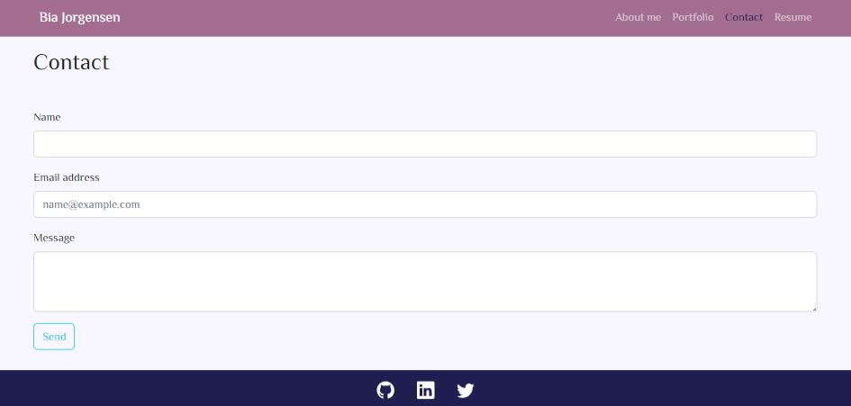
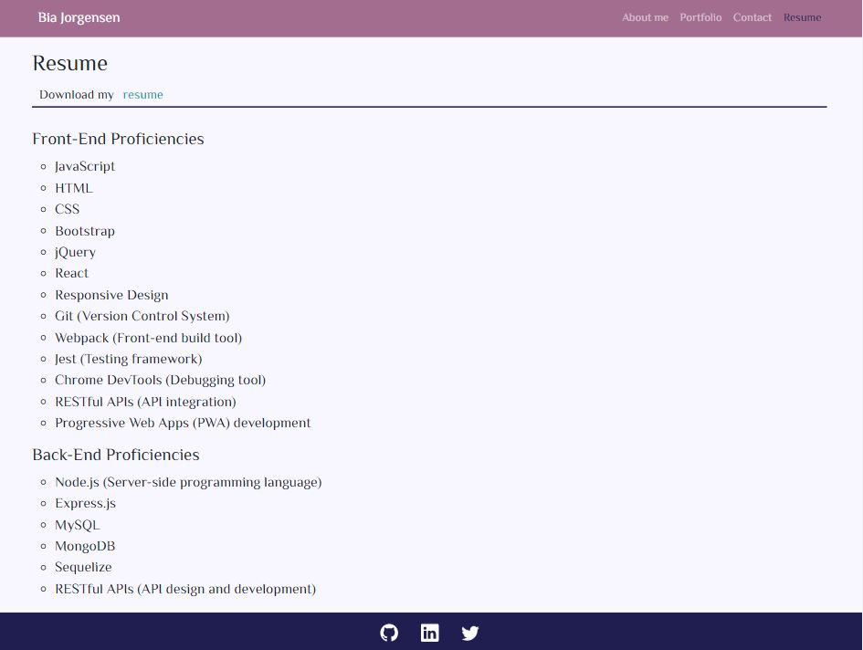

# Personal Portfolio 

## Table of Contents
  [Description](#description) 
  [Usage](#usage) 
  [Credits](#credits) 
  [License](#license) 
  [Link to deployed application](#link-to-deployed-application) 
  [Website preview](#website-preview) 
  [Learn More](#learn-more) 
  [Questions](#questions)

## Description
Personal Portfolio project is a React web application created to showcase some of my personal projects developed as part of challenges from Full Stack Coding Bootcamp at the University of Minnesota.

## Usage

1. Open deployed application
1. On the About me page, you can read a little bit about me
1. Using the navigation Bar:
    * Navigate to the Portfolio page to see six of my projects
        * Hover over the project's images so you can have access to the links of the deployed application and corresponding Github repositories 
    * Navigate to  the Contact page to send me a message
    * Navigate to the Resume page to view some of the technologies I am familiar with, and be able to download my resume
1. On the footer of the page, click on the GitHub, LinkedIn and Twitter icons to view my personal profile
 
## Credits

University of Minnesota - Full Stack Coding Bootcamp 
[React Bootstrap Documentation](https://react-bootstrap.netlify.app/) 
[W3 schools](https://www.w3schools.com/) 
[MDN Web Docs](https://developer.mozilla.org/en-US/) 
[freeCodeCamp](https://www.freecodecamp.org/) 
[Web Dev Simplified](https://www.youtube.com/@WebDevSimplified) 
[PedroTech](https://www.youtube.com/@PedroTechnologies) 
[Kevin Powell](https://www.youtube.com/@KevinPowell) 
[Dave Gray Teaches Code](https://www.youtube.com/@DaveGrayTeachesCode) 
[Brian Design](https://www.youtube.com/@briandesign) 
[Chaoo Charles](https://www.youtube.com/@ChaooCharles) 
[Coolors](https://coolors.co/) 
[Remove Background](https://www.remove.bg/) 
[Favicon.io](https://favicon.io/)
  
[Back to top](#personal-portfolio-)

## License

The license for this project is **The MIT License** 
To learn more about this license, please access https://opensource.org/licenses/MIT
  
[Back to top](#personal-portfolio-)

## Link to deployed application

https://biajorgensen.github.io/bia-jorgensen-portfolio/

  
[Back to top](#personal-portfolio-)

## Website preview

<kbd></kbd> 
<kbd></kbd> 
<kbd></kbd> 
<kbd></kbd> 
  
[Back to top](#personal-portfolio-)

## Learn More

To learn React, check out the [React documentation](https://reactjs.org/).
  
[Back to top](#personal-portfolio-)

## Questions
Visit my GitHub profile page: https://github.com/BiaJorgensen 
If you have additional questions, please send an email to souzabeatriz17@gmail.com
  
[Back to top](#personal-portfolio-)